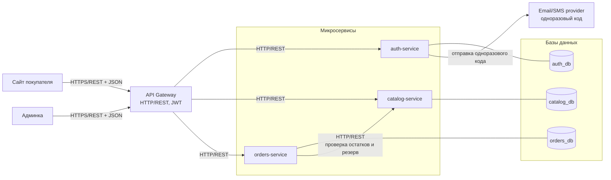

# 02. Архитектура верхнего уровня

## 1. Цель документа

Зафиксировать верхнеуровневую архитектуру интернет-магазина парфюмерии на разлив «КОМНАТА 26»: состав компонентов, их зоны ответственности, протоколы взаимодействия и схему авторизации. Документ описывает систему в терминах «что есть» и «кто кого вызывает»; детализация по сервисам — в `08-microservices.md`, по БД — в `05-database.md`, по эндпоинтам — в `06-api/`.

## 2. Диаграмма компонентов



## 3. Компоненты

### Сайт покупателя
Самостоятельная сборка фронтенда для покупателя (каталог, карточка товара, корзина, оформление заказа, личный кабинет). Общается только с API Gateway по HTTPS, формат — JSON. Хранит JWT покупателя в `localStorage` и подписывает им запросы в заголовке `Authorization`.

### Админка
Отдельная сборка фронтенда админки (вход, управление товарами, управление заказами). Общается только с API Gateway по HTTPS, формат — JSON. Хранит JWT администратора и подписывает им все запросы.

### API Gateway
Единая точка входа для обоих фронтендов. Отвечает за:
- маршрутизацию запросов на нужный микросервис по префиксу пути (`/api/auth/*`, `/api/catalog/*`, `/api/orders/*`);
- валидацию JWT, выданного auth-service: проверка подписи, срока жизни, извлечение `user_id` и `role`;
- проброс идентификатора пользователя и роли в downstream-сервисы через заголовки `X-User-Id` и `X-User-Role`;
- проверку доступа к admin-эндпоинтам (`role=admin`) ещё на уровне Gateway, до проксирования вниз;
- терминирование TLS и CORS.

Внутрь Gateway → микросервисы: HTTP/REST в приватной сети, без TLS.

### auth-service
Единый сервис авторизации и аутентификации для всех пользователей системы. Хранит учётные записи (`users` с полем `role`), сессии и одноразовые коды. Реализует два сценария входа:
- покупатель — по одноразовому коду (email/SMS);
- администратор — по email и паролю.

Выдаёт JWT с полями `user_id` и `role`. Не знает про товары и заказы.

### catalog-service
Каталог: товары, бренды, страны, варианты объёма (5/10/30 мл), цены, остатки, активность товара. Принимает запросы от Gateway по HTTP/REST. Используется покупателем (чтение каталога), администратором (CRUD, по JWT с `role=admin`) и orders-service (проверка наличия и резерв).

### orders-service
Корзина (гостевая по `session_id`, пользовательская по `user_id`), заказы, позиции заказа, статусы, точки самовывоза. Принимает запросы от Gateway по HTTP/REST. Идентификатор пользователя приходит из заголовка `X-User-Id`, который проставляет Gateway после валидации JWT. С auth-service напрямую не общается. Синхронно ходит в catalog-service для проверки остатков и резерва при оформлении заказа.

### Базы данных
По одной БД на сервис, прямой доступ между сервисами запрещён. PostgreSQL.

### Email/SMS provider
Внешний сервис (SMTP-релей или SMS-шлюз) для отправки одноразового кода покупателю при входе. Дёргается только из auth-service. Для администратора внешний сервис не используется — пароль проверяется локально.

## 4. Авторизация

Авторизация всех пользователей сосредоточена в auth-service. Различаются только сценарии входа; результат одинаковый — JWT с `user_id` и `role`.

### Покупатель
1. Покупатель вводит email или телефон в форме входа.
2. Сайт покупателя → Gateway → auth-service: `POST /api/auth/customer/request-code`.
3. auth-service генерирует 6-значный код, сохраняет хеш в `otp_codes` с TTL, отправляет код через email/SMS-провайдера.
4. Покупатель вводит код, Сайт покупателя → Gateway → auth-service: `POST /api/auth/customer/verify-code`.
5. При успехе auth-service возвращает JWT с `role: customer` и `user_id`.
6. Сайт покупателя сохраняет JWT и подписывает им последующие запросы.

Гостевая корзина живёт по `session_id` (cookie/localStorage) до первого логина. При логине Сайт покупателя может вызвать слияние гостевой корзины с пользовательской на стороне orders-service.

### Администратор
1. Администратор вводит email и пароль на странице входа в админку.
2. Админка → Gateway → auth-service: `POST /api/auth/admin/login`.
3. auth-service сверяет хеш пароля в `users` (где `role=admin`), создаёт запись в `sessions`, возвращает JWT с `role: admin`.
4. Админка подписывает этим JWT все запросы к Gateway. Gateway пропускает их в catalog-service и orders-service только при `role=admin` для admin-эндпоинтов.

JWT един по формату для всех ролей: подпись HS256/RS256, в полезной нагрузке `user_id`, `role`, `exp`. Различаются только сроки жизни и набор разрешённых эндпоинтов.

## 5. Поток запроса «положить товар в корзину»

```
Сайт покупателя
   |
   |  POST /api/orders/cart/items
   |  Authorization: Bearer <jwt-customer>   (для гостя — отсутствует, передаётся X-Session-Id)
   |  body: { product_id, variant_id, quantity }
   v
API Gateway
   |  валидирует JWT, извлекает user_id и role,
   |  пробрасывает заголовки X-User-Id, X-User-Role
   |  (для гостя — X-Session-Id)
   v
orders-service
   |
   |  GET /api/catalog/internal/variants/<variant_id>
   |  (внутренний HTTP-вызов)
   v
catalog-service
   |  проверяет: товар активен, вариант объёма существует,
   |  остаток >= запрошенного количества;
   |  возвращает актуальную цену и остаток
   v
orders-service
   |  добавляет позицию в корзину (по user_id или session_id),
   |  возвращает обновлённую корзину
   v
API Gateway
   v
Сайт покупателя  →  обновляет UI корзины
```

Резерв остатка на этом шаге не происходит — он выполняется только при оформлении заказа (`POST /api/orders`), там orders-service второй раз идёт в catalog-service за резервом, чтобы избежать «зависших» резервов от брошенных корзин.
