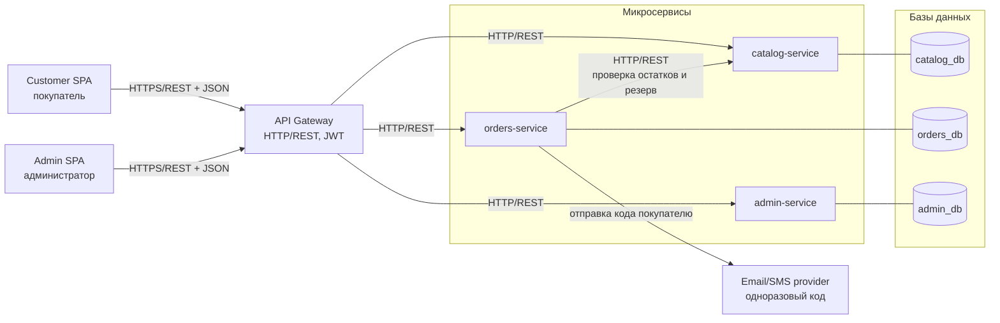

# 02. Архитектура верхнего уровня

## 1. Цель документа

Зафиксировать верхнеуровневую архитектуру интернет-магазина парфюмерии на разлив «КОМНАТА 26»: состав компонентов, их зоны ответственности, протоколы взаимодействия и схему авторизации. Документ описывает систему в терминах «что есть» и «кто кого вызывает»; детализация по сервисам — в `08-microservices.md`, по БД — в `05-database.md`, по эндпоинтам — в `06-api/`.

## 2. Диаграмма компонентов



## 3. Компоненты

### Customer SPA
Самостоятельная сборка фронтенда для покупателя (каталог, карточка товара, корзина, оформление заказа, личный кабинет). Общается только с API Gateway по HTTPS, формат — JSON. Хранит JWT покупателя в `localStorage` и подписывает им запросы в заголовке `Authorization`.

### Admin SPA
Отдельная сборка фронтенда админки (вход, управление товарами, управление заказами). Общается только с API Gateway по HTTPS, формат — JSON. Хранит JWT администратора и подписывает им все запросы.

### API Gateway
Единая точка входа для обоих фронтендов. Отвечает за:
- маршрутизацию запросов на нужный микросервис по префиксу пути (`/catalog/*`, `/orders/*`, `/admin/*`);
- валидацию JWT и проверку роли (`customer` / `admin`) до проксирования вниз;
- проброс идентификатора пользователя в заголовке во внутренние сервисы;
- терминирование TLS и CORS.

Внутрь Gateway → микросервисы: HTTP/REST в приватной сети, без TLS.

### catalog-service
Каталог: товары, бренды, страны, варианты объёма (5/10/30 мл), цены, остатки, бейджи («Хит продаж», «Скидка»), активность товара. Принимает запросы от Gateway по HTTP/REST. Используется покупателем (чтение каталога), администратором (CRUD) и orders-service (проверка наличия и резерв).

### orders-service
Корзина, заказы, позиции заказа, статусы, точки самовывоза, контактные данные покупателей, история заказов. Принимает запросы от Gateway по HTTP/REST. Синхронно ходит в catalog-service для проверки остатков и резерва при оформлении заказа. Дёргает внешний email/SMS-провайдер для отправки одноразового кода при логине покупателя.

### admin-service
Учётные записи администраторов, хранение хешей паролей, выдача JWT админа, сессии. Не знает про товары и заказы. Принимает запросы от Gateway по HTTP/REST.

### Базы данных
По одной БД на сервис, прямой доступ между сервисами запрещён. PostgreSQL.

### Email/SMS provider
Внешний сервис (например, SMTP-релей и SMS-шлюз) для отправки одноразового кода покупателю при входе. Для администратора внешний сервис не используется — авторизация по email+паролю целиком внутри admin-service.

## 4. Авторизация

### Покупатель
1. Покупатель вводит email или телефон в форме входа.
2. Customer SPA → Gateway → orders-service: запрос на отправку одноразового кода.
3. orders-service генерирует 6-значный код, сохраняет хеш с TTL, отправляет код через email/SMS-провайдера.
4. Покупатель вводит код, Customer SPA → Gateway → orders-service: проверка кода.
5. При успехе orders-service возвращает JWT с `role: customer` и идентификатором покупателя.
6. Customer SPA сохраняет JWT и подписывает им последующие запросы.

Гостевая корзина живёт по идентификатору сессии в cookie/localStorage до первого логина; при логине её содержимое сливается с корзиной покупателя на стороне orders-service.

### Администратор
1. Администратор вводит email и пароль на отдельной странице админки.
2. Admin SPA → Gateway → admin-service: проверка учётки.
3. admin-service сверяет хеш пароля и возвращает JWT с `role: admin`.
4. Admin SPA подписывает этим JWT все запросы к Gateway. Gateway пропускает их в catalog-service и orders-service только при `role: admin`.

JWT покупателя и JWT администратора — два разных токена с разными ролями и временем жизни; пересечений нет.

## 5. Поток запроса «положить товар в корзину»

```
Customer SPA
   |
   |  POST /orders/cart/items
   |  Authorization: Bearer <jwt-customer>
   |  body: { product_id, volume_id, quantity }
   v
API Gateway
   |  валидирует JWT, проверяет role=customer,
   |  пробрасывает customer_id в заголовке
   v
orders-service
   |
   |  GET /catalog/products/<id>/volumes/<volume_id>
   |  (внутренний HTTP-вызов)
   v
catalog-service
   |  проверяет: товар активен, вариант объёма существует,
   |  остаток >= запрошенного количества
   |  возвращает актуальную цену и остаток
   v
orders-service
   |  добавляет позицию в корзину покупателя,
   |  возвращает обновлённую корзину
   v
API Gateway
   v
Customer SPA  →  обновляет UI корзины
```

Резерв остатка на этом шаге не происходит — он выполняется только при оформлении заказа (`POST /orders`), там orders-service второй раз идёт в catalog-service за резервом, чтобы избежать «зависших» резервов от брошенных корзин.
