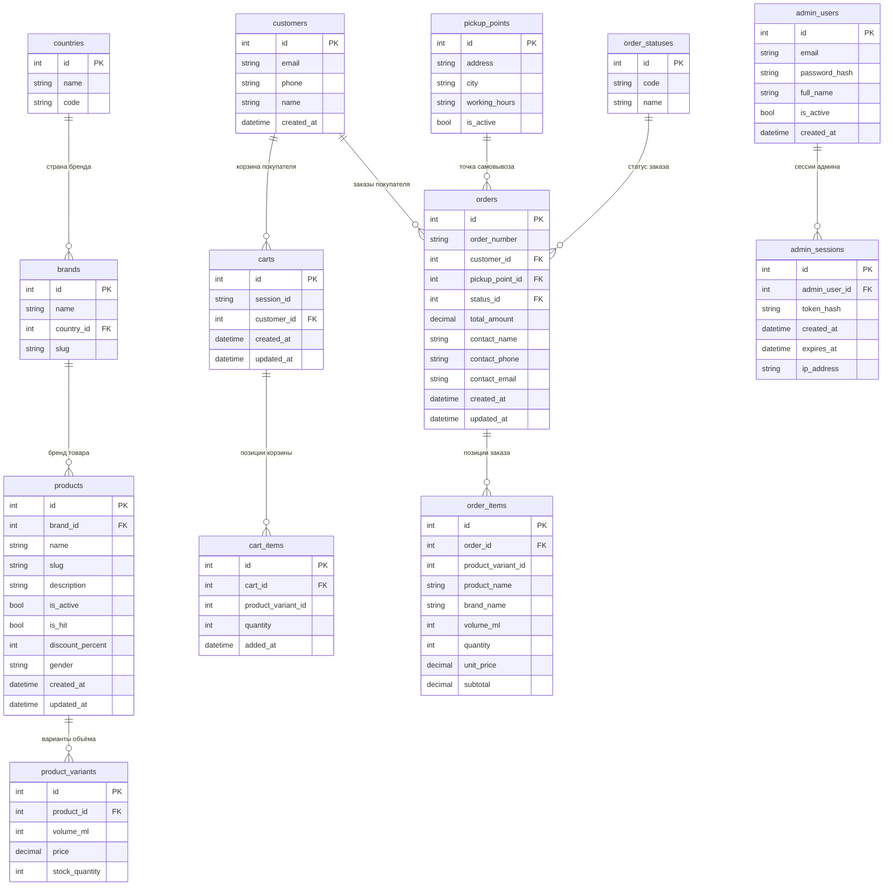

# 05. База данных

ER-диаграмма данных интернет-магазина «КОМНАТА 26». Архитектура разделена на три микросервиса с независимыми БД: `catalog_db` (товары и каталожные справочники), `orders_db` (корзины, заказы, покупатели, точки самовывоза) и `admin_db` (администраторы и их сессии). Межсервисные ссылки на `product_variant_id` — логические, без физических FK; критичные поля товара сохраняются снапшотом в `order_items`.

## Легенда: распределение таблиц по сервисам

| Сущность            | Сервис      |
|---------------------|-------------|
| `countries`         | catalog_db  |
| `brands`            | catalog_db  |
| `products`          | catalog_db  |
| `product_variants`  | catalog_db  |
| `customers`         | orders_db   |
| `carts`             | orders_db   |
| `cart_items`        | orders_db   |
| `pickup_points`     | orders_db   |
| `order_statuses`    | orders_db   |
| `orders`            | orders_db   |
| `order_items`       | orders_db   |
| `admin_users`       | admin_db    |
| `admin_sessions`    | admin_db    |
