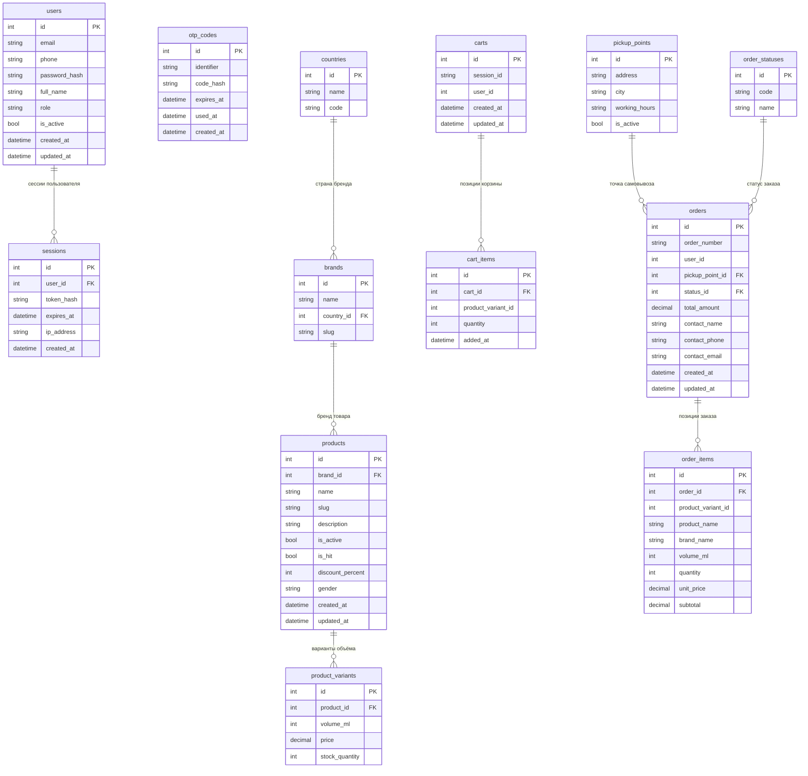

# 05. База данных

ER-диаграмма данных интернет-магазина «КОМНАТА 26». Архитектура разделена на три микросервиса с независимыми БД: `auth_db` (пользователи, сессии, OTP-коды), `catalog_db` (товары и каталожные справочники) и `orders_db` (корзины, заказы, точки самовывоза). Межсервисные ссылки на `user_id` и `product_variant_id` — логические, физических FK между БД нет.

> Логические межсервисные ссылки (без физических FK): `carts.user_id` и `orders.user_id` → `auth_db.users.id`; `cart_items.product_variant_id` и `order_items.product_variant_id` → `catalog_db.product_variants.id`. Поля `order_items.product_name`, `brand_name`, `volume_ml`, `unit_price` — снапшот товара на момент оформления заказа.

## Легенда: распределение таблиц по сервисам

| Сущность            | Сервис       |
|---------------------|--------------|
| `users`             | auth_db      |
| `sessions`          | auth_db      |
| `otp_codes`         | auth_db      |
| `countries`         | catalog_db   |
| `brands`            | catalog_db   |
| `products`          | catalog_db   |
| `product_variants`  | catalog_db   |
| `pickup_points`     | orders_db    |
| `order_statuses`    | orders_db    |
| `carts`             | orders_db    |
| `cart_items`        | orders_db    |
| `orders`            | orders_db    |
| `order_items`       | orders_db    |
