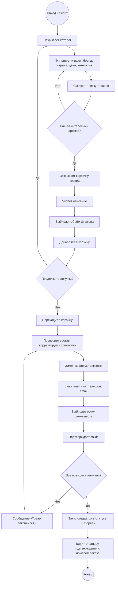
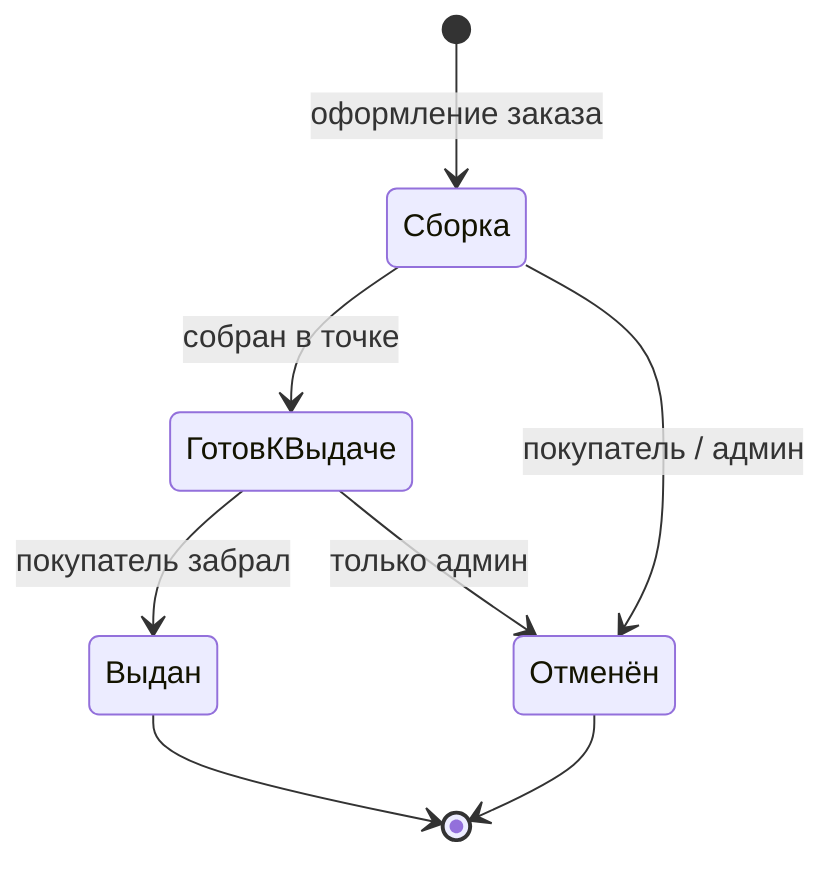

# 07. Логика и сценарии

## Цель документа

Описывает путь покупателя от первого захода на сайт до получения заказа: какие страницы он проходит, какие решения принимает и через какие статусы движется заказ. Технические детали (межсервисные вызовы, формат запросов) — в `02-architecture.md` и `06-api/`.

---

## 1. Путь покупателя (CJM)

Высокоуровневая активити-диаграмма покупательского сценария — от захода в магазин до подтверждения заказа. Показывает основные шаги клиента, без раскладки по микросервисам.

Дополнительные ветки доступны зарегистрированному покупателю: вход по одноразовому коду (на этапе корзины или оформления) и просмотр истории заказов в личном кабинете. Гость может оформить заказ без регистрации — отслеживание идёт по номеру заказа и контактам.

---

## 2. Жизненный цикл заказа

После оформления заказ автоматически попадает в статус «Сборка». Дальнейшие переходы делает администратор по факту физических действий в точке самовывоза. Стадия отдельного «подтверждения» админом не нужна — заказ сразу идёт в работу.

`ГотовКВыдаче` — формальное имя состояния (Mermaid не допускает пробелы); в интерфейсах отображается как «Готов к выдаче».

| Статус | Описание | Кто переводит |
|--------|----------|----------------|
| Сборка | Заказ оформлен, собирается в точке самовывоза | Создаётся системой при оформлении |
| Готов к выдаче | Заказ собран, ждёт покупателя в точке | Администратор |
| Выдан | Покупатель пришёл, забрал и оплатил | Администратор |
| Отменён | Отменён до выдачи | Покупатель (до «Готов к выдаче») / Администратор |

Покупатель может отменить заказ из личного кабинета только пока он в статусе «Сборка». После перехода в «Готов к выдаче» отмена — только через администратора (например, если покупатель не пришёл).

---

## 3. Обработка ошибок

Сценарии отказа в потоке оформления заказа:

| Сценарий | Где детектируется | Реакция системы |
|----------|-------------------|-----------------|
| Пустая корзина при попытке оформить | Сайт покупателя (до перехода на checkout) | Кнопка «Оформить заказ» неактивна; при принудительном переходе — редирект в корзину с сообщением «Добавьте товары в корзину» |
| Невалидные контактные данные (имя, телефон, email) | Сайт покупателя, форма checkout | Подсветка проблемных полей, текст ошибки под полем; запрос на создание заказа не отправляется |
| Невалидный или просроченный JWT | API Gateway | 401 Unauthorized, downstream-сервисы не вызываются; сайт редиректит покупателя на форму входа |
| Товар закончился | catalog-service на проверке остатков при оформлении | orders-service возвращает 409; сайт показывает «Товар закончился, скорректируйте корзину» и возвращает в корзину |
| Сетевая ошибка между orders и catalog | orders-service на sync-вызовах | Заказ не создаётся, остатки не списываются; сайт показывает «Сервис временно недоступен, попробуйте ещё раз». Никаких частичных резервов |
| Отмена после стадии «Готов к выдаче» | Сайт покупателя в ЛК + orders-service | В ЛК кнопка отмены скрыта; прямой запрос от покупателя на orders-service отбивается 403. Отменить может только администратор |

---

## 4. Авторизация в потоке

Оформление заказа доступно и гостю, и зарегистрированному покупателю — разница только в заголовках, которые доходят до orders-service от API Gateway.

**Гость.** Сайт отправляет запрос на создание заказа без `Authorization`, но с заголовком `X-Session-Id` (идентификатор гостевой сессии, по которому живёт гостевая корзина). Gateway пропускает запрос без валидации JWT и пробрасывает `X-Session-Id` дальше. orders-service создаёт заказ с `user_id = NULL`, а контактные данные (`contact_name`, `contact_phone`, `contact_email`) сохраняет прямо в `orders` как снапшот. Доступа в ЛК у такого заказа нет — поиск по номеру и email возможен только на стороне администратора.

**Зарегистрированный покупатель.** Сайт отправляет запрос с `Authorization: Bearer <jwt-customer>`. Gateway валидирует подпись JWT (выданного auth-service), извлекает `user_id` и `role=customer`, пробрасывает их в заголовках `X-User-Id` и `X-User-Role`. orders-service сохраняет заказ с этим `user_id`; заказ появляется в истории ЛК (`account-orders`), доступен на странице `account-order`, и оттуда же покупатель может его отменить до перехода в статус «Готов к выдаче».

**Администратор.** Действия по управлению заказами идут с JWT, где `role=admin`. Gateway сам отсекает обращения без `role=admin` к admin-эндпоинтам orders-service. Никакого отдельного admin-service в потоке нет — администратор технически такой же пользователь, просто с другой ролью в токене.
