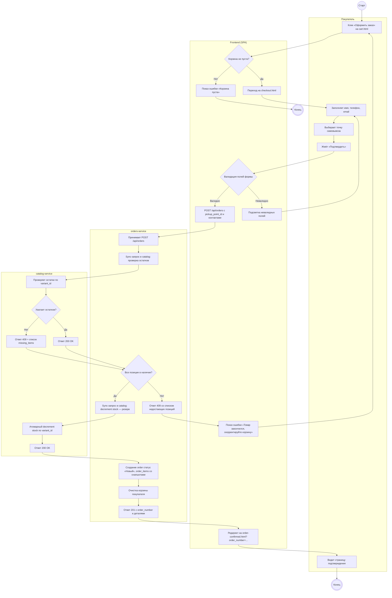
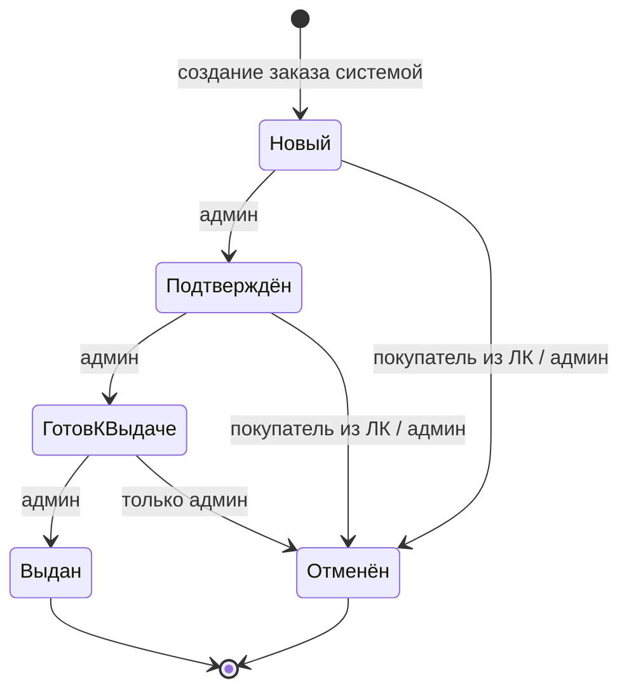

# 07. Логика оформления заказа

## Цель документа

Документ описывает сквозную логику оформления заказа в интернет-магазине «КОМНАТА 26» — от момента, когда покупатель нажимает «Оформить заказ» в корзине, до отображения страницы подтверждения. Фиксируются шаги фронтенда, межсервисные вызовы между `orders-service` и `catalog-service`, проверки наличия остатков и резервирование, жизненный цикл статусов заказа, а также сценарии обработки ошибок и правила авторизации в потоке.

---

## 1. Activity diagram оформления заказа

«Дорожки» выделены через `subgraph` для покупателя, фронтенда, `orders-service` и `catalog-service`. Условия — ромбы, действия — прямоугольники, начало/конец — круглые узлы.

---

## 2. State diagram статусов заказа

Подписи на переходах указывают инициатора. «Покупатель» — действие из личного кабинета; «Админ» — действие из админки.

Состояние `ГотовКВыдаче` обозначает «Готов к выдаче» (Mermaid не допускает пробелы в именах состояний). На стороне покупателя в ЛК отмена доступна только до статуса «Готов к выдаче» включительно по входу, но не выходу: как только заказ переведён в «Готов к выдаче», кнопка отмены у покупателя скрывается.

---

## 3. Обработка ошибок

| Сценарий | Где детектируется | Реакция системы |
|----------|-------------------|-----------------|
| Пустая корзина при попытке оформить | Frontend (SPA) до перехода на checkout | Кнопка «Оформить заказ» неактивна; при принудительном переходе — редирект обратно на cart.html с сообщением «Добавьте товары в корзину» |
| Невалидные контактные данные (имя, телефон, email) | Frontend, клиентская валидация на checkout.html | Подсветка проблемных полей, текст ошибки под полем; запрос на `POST /api/orders` не отправляется |
| Товар закончился (409 от catalog-service) | catalog-service на этапе проверки остатков | orders-service возвращает 409 со списком позиций; Frontend показывает «Товар закончился, скорректируйте корзину» и предлагает вернуться в cart.html |
| Сетевая ошибка между orders и catalog (таймаут / 5xx) | orders-service на sync-вызовах | Заказ не создаётся, остатки не списываются; Frontend получает 503 и показывает «Сервис временно недоступен, попробуйте ещё раз». Никаких частичных резервов |
| Ошибка при decrement stock после успешной проверки | catalog-service на втором sync-вызове | orders-service не создаёт order, возвращает 409/503; ранее проверенные остатки не считаются зарезервированными — повтор оформления заново |
| Отмена заказа после стадии «Готов к выдаче» | Frontend в ЛК + orders-service | В ЛК кнопка отмены скрыта; прямой `PATCH` от покупателя на orders-service отбивается 403 «Отмена недоступна на текущем статусе». Отменить может только админ |

---

## 4. Авторизация в потоке

Оформление заказа доступно и гостю, и зарегистрированному покупателю. Гость отправляет `POST /api/orders` без токена — заказ создаётся с `customer_id = NULL`, контактные данные сохраняются прямо в заказе и доступа в ЛК у такого заказа нет (поиск по номеру и email на стороне админа).

Зарегистрированный покупатель передаёт JWT в заголовке `Authorization: Bearer <token>`. `orders-service` извлекает `customer_id` из токена и привязывает заказ к пользователю; заказ появляется в истории ЛК (`account-orders.html`), доступен на `account-order.html`, и оттуда же покупатель может его отменить до перехода в статус «Готов к выдаче». Авторизация админов идёт через отдельный `admin-service` и не пересекается с потоком покупателя.
