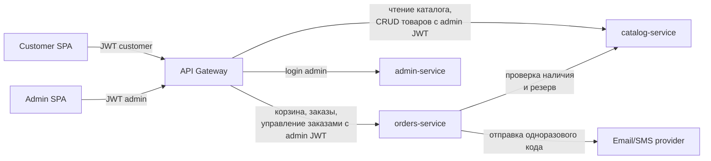

# 08. Микросервисы

## 1. Принципы декомпозиции

- **Один сервис — один bounded context (DDD).** Каждый сервис владеет ровно одной предметной областью и не лезет в чужую.
- **Одна БД на сервис.** Прямой SQL-доступ к чужой БД запрещён. Любые данные другого сервиса берутся только через его HTTP API.
- **Никакого shared state между сервисами.** Если двум сервисам нужны одни и те же данные — один из них владелец, другой ходит по API.
- **Синхронное взаимодействие — HTTP/REST + JSON.** Очереди и асинхронщина в MVP не используются.
- **Идентификатор пользователя — наружу через JWT.** Внутри сервиса роль и `user_id` приходят из заголовков, которые проставляет Gateway после валидации токена.

## 2. Сервисы

### 2.1. catalog-service

**Ответственность:**
- Каталог товаров: бренды, страны, ароматы, описания, картинки.
- Варианты объёма (5/10/30 мл): цена, остаток, активность варианта.
- Бейджи на карточке: «Хит продаж», «Скидка» (процент скидки).
- Активность товара (скрытие из каталога без удаления).
- Резервирование остатков при оформлении заказа (по запросу orders-service).

**Не входит:** заказы, корзины, пользователи, скидочные промокоды.

**Сущности в БД (перечень):** Brand, Country, Product, ProductVolume, Badge.
Подробности — в `docs/05-database.md`.

**Основные API-операции (перечень):**
- Публичные (покупатель): листинг каталога с фильтрами, поиск, получение карточки товара, список брендов и стран.
- Админские: CRUD товара, CRUD вариантов объёма, управление бейджами и активностью, изменение остатков.
- Внутренние (для orders-service): проверка наличия варианта объёма, резерв/освобождение остатка.

Подробности — в `docs/06-api/catalog.md`.

**Синхронно общается с:** только принимает запросы (от Gateway и от orders-service). Сам никуда не ходит.

---

### 2.2. orders-service

**Ответственность:**
- Корзина покупателя (гостевая и пользовательская) и слияние гостевой корзины при логине.
- Оформление заказа: контакты, выбор точки самовывоза, расчёт суммы, фиксация цен на момент заказа.
- Заказы и позиции заказа.
- Статусы заказа и их жизненный цикл (Новый → Подтверждён → Готов к выдаче → Выдан / Отменён).
- Справочник точек самовывоза.
- Учётные записи покупателей (email/телефон) и история заказов.
- Авторизация покупателя по одноразовому коду + выдача JWT с `role: customer`.

**Не входит:** товары и остатки, авторизация админов.

**Сущности в БД (перечень):** Customer, Cart, CartItem, Order, OrderItem, OrderStatus, PickupPoint, OtpCode.
Подробности — в `docs/05-database.md`.

**Основные API-операции (перечень):**
- Покупательские: получение/изменение корзины, оформление заказа, история заказов, отмена заказа, редактирование контактов, запрос/проверка одноразового кода.
- Админские: листинг заказов с фильтрами, детали заказа, смена статуса, CRUD точек самовывоза.
- Публичные: список точек самовывоза.

Подробности — в `docs/06-api/orders.md`.

**Синхронно общается с:**
- catalog-service — проверка наличия и резерв остатков при оформлении заказа, чтение актуальной цены при добавлении в корзину.
- внешний email/SMS-провайдер — отправка одноразового кода.

---

### 2.3. admin-service

**Ответственность:**
- Учётные записи администраторов (email, хеш пароля).
- Аутентификация админа по email+паролю.
- Выдача и валидация JWT с `role: admin`.
- Сессии админов (logout, отзыв токенов).

**Не входит:** товары, заказы, покупатели, любые бизнес-данные магазина.

**Сущности в БД (перечень):** AdminUser, AdminSession.
Подробности — в `docs/05-database.md`.

**Основные API-операции (перечень):**
- Логин (email + пароль → JWT).
- Logout / отзыв сессии.
- Проверка/обновление токена.

Подробности — в `docs/06-api/admin.md`.

**Синхронно общается с:** только принимает запросы от Gateway. Сам никуда не ходит.

## 3. Межсервисные взаимодействия

Ключевые потоки:
- **Admin SPA → admin-service** (через Gateway): только логин и обновление токена.
- **Admin SPA → catalog-service** (через Gateway, с admin JWT): CRUD товаров, вариантов объёма, бейджей, остатков.
- **Admin SPA → orders-service** (через Gateway, с admin JWT): просмотр и смена статусов заказов, CRUD точек самовывоза.
- **Customer SPA → catalog-service** (через Gateway, анонимно или с customer JWT): чтение каталога.
- **Customer SPA → orders-service** (через Gateway, анонимно или с customer JWT): корзина, оформление заказа, личный кабинет, логин по коду.
- **orders-service → catalog-service** (внутренний HTTP): проверка наличия при добавлении в корзину, резерв остатка при оформлении заказа.

## 4. Сводная таблица

| Сервис           | БД          | Логический порт | Кто вызывает                        |
|------------------|-------------|-----------------|--------------------------------------|
| catalog-service  | catalog_db  | 8001            | Gateway, orders-service              |
| orders-service   | orders_db   | 8002            | Gateway                              |
| admin-service    | admin_db    | 8003            | Gateway                              |
| API Gateway      | —           | 8080            | Customer SPA, Admin SPA              |

Порты приведены как ориентир для локальной разработки и `docker-compose`; в проде они скрыты за Gateway.

## 5. Обоснование границ

**Почему именно три сервиса.**

Каталог и заказы — два независимых bounded context из классической e-commerce-декомпозиции:
- у каталога свой ритм изменений (контент-менеджмент админом, редкие апдейты остатков) и read-heavy нагрузка от покупателей;
- у заказов — транзакционная природа, статусная машина, привязка к покупателю и точке самовывоза;
- они связаны ровно одной операцией — резерв остатка при оформлении заказа, и это естественная синхронная граница.

**Почему admin-service — отдельный сервис, а не часть catalog-service / orders-service.**

В MVP админка содержательно работает только с товарами и заказами, поэтому возникает соблазн запихнуть аутентификацию админа в один из этих сервисов или размазать по обоим. Этого не делаем по трём причинам:

1. **Аутентификация — отдельная зона ответственности.** Хранение хешей паролей, политика сессий, ротация токенов — это про безопасность, а не про парфюмерию. Эту зону логично изолировать.
2. **Нет дублирования.** Если положить auth админа в catalog-service, то orders-service всё равно придётся валидировать тот же JWT — значит, понадобится либо дублировать ключи и логику, либо ходить за валидацией в catalog-service, что делает каталог критической зависимостью админки заказов. Отдельный admin-service выдаёт токен один раз, остальные сервисы только проверяют подпись.
3. **Разные роли в будущем легко наращивать.** За пределами MVP в `00-product-decisions.md` уже отмечено «несколько ролей у администраторов». Расширять модель ролей в выделенном сервисе дешевле, чем переезжать с auth, прибитой к каталогу.

**Что осознанно не выделили в отдельные сервисы.**

- **Уведомления.** Отправка одноразового кода — единичный сценарий, отдельный notification-service для одного исходящего вызова в MVP избыточен. Если в пост-MVP появятся email/SMS уведомления о статусах заказа (см. п.13 продуктовых решений), notification-service станет оправдан.
- **Покупатели как отдельный customer-service.** Данные покупателя (контакты, история) на 100% живут вместе с заказами и корзиной, отдельная сущность снаружи не нужна. Выделим, если появятся независимые потребители профиля.
