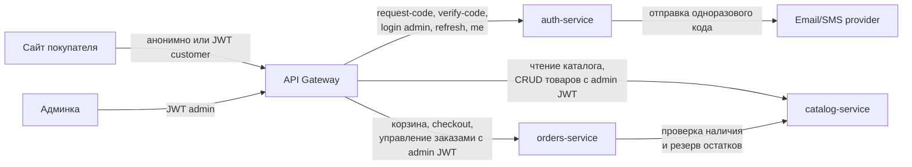

# 08. Микросервисы

## 1. Принципы декомпозиции

- **Один сервис — один bounded context (DDD).** Каждый сервис владеет ровно одной предметной областью и не лезет в чужую.
- **Одна БД на сервис.** Прямой SQL-доступ к чужой БД запрещён. Любые данные другого сервиса берутся только через его HTTP API.
- **Никакого shared state между сервисами.** Если двум сервисам нужны одни и те же данные — один из них владелец, другой ходит по API.
- **Синхронное взаимодействие — HTTP/REST + JSON.** Очереди и асинхронщина в MVP не используются.
- **Идентификация пользователя проходит через JWT и API Gateway.** Внутри сервиса `user_id` и `role` приходят из заголовков `X-User-Id` / `X-User-Role`, которые проставляет Gateway после валидации токена, выданного auth-service. Сами downstream-сервисы в auth-service не ходят.

## 2. Сервисы

### 2.1. auth-service

**Ответственность:**
- Учётные записи всех пользователей (покупатели и админы) в единой таблице с полем `role`.
- Аутентификация покупателя по одноразовому коду (email/SMS).
- Аутентификация админа по email + паролю.
- Выдача и валидация JWT (`user_id`, `role`, `exp`).
- Хранение сессий (для logout и отзыва) и одноразовых кодов с TTL.
- Вызов внешнего email/SMS-провайдера для отправки кода.

**Не входит:** товары, заказы, корзины, любые бизнес-данные магазина.

**Сущности в БД (перечень):** `users`, `sessions`, `otp_codes`.
Подробности — в `docs/05-database.md`.

**Основные API-операции (перечень):**
- Покупатель: `POST /api/auth/customer/request-code`, `POST /api/auth/customer/verify-code`.
- Админ: `POST /api/auth/admin/login`.
- Общие: `POST /api/auth/logout`, `POST /api/auth/refresh`, `GET /api/auth/me`.

Подробности — в `docs/06-api/auth.md`.

**Синхронно общается с:**
- внешний email/SMS-провайдер — отправка одноразового кода покупателю.

Сам по сетевым API никуда больше не ходит. Другие сервисы в auth-service не обращаются: проверка JWT делегирована Gateway по подписи.

---

### 2.2. catalog-service

**Ответственность:**
- Каталог товаров: бренды, страны, ароматы, описания, картинки.
- Варианты объёма (5/10/30 мл): цена, остаток, активность варианта.
- Активность товара (скрытие из каталога без удаления).
- Резервирование остатков при оформлении заказа (по запросу orders-service).

**Не входит:** заказы, корзины, пользователи, авторизация.

**Сущности в БД (перечень):** `countries`, `brands`, `products`, `product_variants`.
Подробности — в `docs/05-database.md`.

**Основные API-операции (перечень):**
- Публичные (покупатель): листинг каталога с фильтрами, поиск, получение карточки товара, список брендов и стран.
- Админские (`role=admin`): CRUD товара, CRUD вариантов объёма, управление активностью, изменение остатков.
- Внутренние (для orders-service): проверка наличия варианта объёма, резерв/освобождение остатка.

Подробности — в `docs/06-api/catalog.md`.

**Синхронно общается с:** только принимает запросы (от Gateway и от orders-service). Сам никуда не ходит.

---

### 2.3. orders-service

**Ответственность:**
- Корзина: гостевая (по `session_id`) и пользовательская (по `user_id`), слияние при логине.
- Оформление заказа: контакты, выбор точки самовывоза, расчёт суммы, фиксация цен на момент заказа.
- Заказы и позиции заказа: для зарегистрированных — с `user_id`; для гостей — `user_id = NULL` плюс снапшот контактов (`contact_name`, `contact_phone`, `contact_email`).
- Статусы заказа и их жизненный цикл (Сборка → Готов к выдаче → Выдан, либо Отменён до выдачи).
- Справочник точек самовывоза.

**Не входит:** товары и остатки, авторизация, учётные записи пользователей.

**Сущности в БД (перечень):** `carts`, `cart_items`, `pickup_points`, `order_statuses`, `orders`, `order_items`.
Подробности — в `docs/05-database.md`.

**Основные API-операции (перечень):**
- Покупательские: получение/изменение корзины (по JWT покупателя или `X-Session-Id` гостя), слияние гостевой корзины при логине, оформление заказа, история заказов, отмена заказа.
- Админские (`role=admin`): листинг заказов с фильтрами, детали заказа, смена статуса, CRUD точек самовывоза.
- Публичные: список точек самовывоза.

Подробности — в `docs/06-api/orders.md`.

**Синхронно общается с:**
- catalog-service — проверка наличия и резерв остатков при оформлении заказа, чтение актуальной цены при добавлении в корзину.

С auth-service напрямую не общается: всё необходимое (`user_id`, `role`) приходит из заголовков от Gateway.

## 3. Межсервисные взаимодействия

Ключевые потоки:
- **Сайт покупателя → auth-service** (через Gateway): запрос кода и верификация для покупателя.
- **Сайт покупателя → catalog-service** (через Gateway, анонимно или с customer JWT): чтение каталога.
- **Сайт покупателя → orders-service** (через Gateway, анонимно по `X-Session-Id` или с customer JWT): корзина, оформление заказа, личный кабинет.
- **Админка → auth-service** (через Gateway): логин по email + паролю.
- **Админка → catalog-service** (через Gateway, с admin JWT): CRUD товаров, вариантов объёма, остатков.
- **Админка → orders-service** (через Gateway, с admin JWT): просмотр и смена статусов заказов, CRUD точек самовывоза.
- **orders-service → catalog-service** (внутренний HTTP): проверка наличия при добавлении в корзину, резерв остатка при оформлении заказа.
- **auth-service → email/SMS-провайдер**: отправка одноразового кода покупателю.

## 4. Сводная таблица

| Сервис           | БД          | Логический порт | Кто вызывает                        | Отвечает за                                                  |
|------------------|-------------|-----------------|--------------------------------------|---------------------------------------------------------------|
| auth-service     | auth_db     | 8001            | Gateway                              | Пользователи, сессии, OTP, выдача JWT                         |
| catalog-service  | catalog_db  | 8002            | Gateway, orders-service              | Товары, варианты объёма, остатки                              |
| orders-service   | orders_db   | 8003            | Gateway                              | Корзины, заказы, точки самовывоза, статусы                    |
| API Gateway      | —           | 8080            | Сайт покупателя, Админка              | Маршрутизация, валидация JWT, проверка роли, CORS, TLS        |

Порты приведены как ориентир для локальной разработки и `docker-compose`; в проде они скрыты за Gateway.

## 5. Обоснование границ

**Почему именно три сервиса.**

Каталог, заказы и авторизация — три независимых bounded context из классической e-commerce-декомпозиции:
- у каталога свой ритм изменений (контент-менеджмент админом, редкие апдейты остатков) и read-heavy нагрузка от покупателей;
- у заказов — транзакционная природа, статусная машина, привязка к пользователю и точке самовывоза;
- у авторизации — отдельная зона ответственности (хеши паролей, OTP, токены, политика сессий).

Каталог и заказы связаны ровно одной операцией — резерв остатка при оформлении заказа, и это естественная синхронная граница.

**Почему авторизация выделена в отдельный auth-service, а не в admin-service.**

В первой версии декомпозиции была идея отдельного admin-service, который владел бы исключительно учётками админов и логином по паролю, а аутентификацию покупателей по одноразовому коду оставить в orders-service. От этого осознанно отказались по четырём причинам:

1. **Единая модель пользователя.** И покупатели, и админы — это `users` с одним и тем же набором полей (id, email, телефон, имя, активность) плюс `role`. Дублировать одну и ту же таблицу в двух сервисах с разным API и разными политиками безопасности бессмысленно.
2. **Унифицированный JWT.** Все downstream-сервисы (catalog, orders) проверяют ровно один тип токена: подпись auth-service, поля `user_id` + `role`. Не нужно поддерживать два формата (admin-JWT и customer-JWT) и два набора ключей.
3. **Расширение ролей в будущем дешевле.** В `00-product-decisions.md` уже отмечено, что в пост-MVP возможны несколько ролей у администраторов (например, контент-менеджер vs менеджер заказов). В единой модели `users.role` это добавление одного значения; в схеме с admin-service пришлось бы либо размножать сервисы, либо переезжать на ту же единую модель позже с миграцией данных.
4. **Логика входа изолирована от бизнес-логики заказов.** Аутентификация покупателя по OTP — это не часть оформления заказа, а отдельный сценарий безопасности. Хранить хеши кодов и логику ротации сессий вместе с корзинами и статусами заказов — смешивать домены.

Админка при этом перестаёт быть «отдельным сервисом» в архитектуре: технически админ — это просто пользователь с `role=admin`. Любой сервис, доверяющий подписи JWT от auth-service, понимает роль и решает, что разрешено. Gateway проверяет роль для admin-эндпоинтов до проксирования.

**Что осознанно не выделили в отдельные сервисы.**

- **Уведомления.** Отправка одноразового кода — единичный сценарий, отдельный notification-service для одного исходящего вызова в MVP избыточен. Если в пост-MVP появятся email/SMS уведомления о статусах заказа, notification-service станет оправдан.
- **Покупатели как customer-service.** В единой модели `users` они уже живут в auth-service; вытаскивать их в отдельный сервис ради профиля и истории заказов в MVP не нужно. История заказов — это данные orders-service по `user_id`, не отдельный домен.
